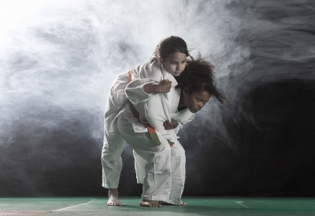

Bienvenue au Judo Club de Juvisy-sur-Orge ! Avec plus de 50 ans d'existence, notre club est un pilier de la communauté sportive de Juvisy-sur-Orge. Chaque année, nous sommes fiers d'accueillir plus de 200 adhérents, de 3 à 70 ans, qui partagent notre passion pour les arts martiaux. Le judo, au cœur de notre programme, véhicule des valeurs saines et constructives telles que le respect, la discipline, et la persévérance.

Notre mission est de promouvoir le judo et les arts martiaux auprès de tous les âges et niveaux. Que vous soyez débutant ou pratiquant expérimenté, vous trouverez chez nous un environnement chaleureux et inclusif pour progresser et vous épanouir. Rejoignez-nous au Judo Club de Juvisy-sur-Orge pour découvrir les nombreux bienfaits du judo et des arts martiaux, et faites partie d'une communauté sportive dynamique et engagée.

---

# Club affilié à la [F.F.J.D.A.](https://www.ffjudo.com/) et ayant le label national.

Professeur : Brevet d’Etat 1er degré – David Bourdon (ceinture noire 3ème DAN)

Renseignements : [{{site.email}}](mailto:{{site.email}})

**Tous niveaux acceptés**

# Reprise des entraînements :

Pour les anciens adhérents et nouveaux, la reprise des entraînements est prévue à partir du **lundi 9 septembre**

# Inscriptions :

Cette année, l'inscription se fera de manière dématérialisée, [rendez-vous sur cette page pour commencer votre inscription](inscription.html).

